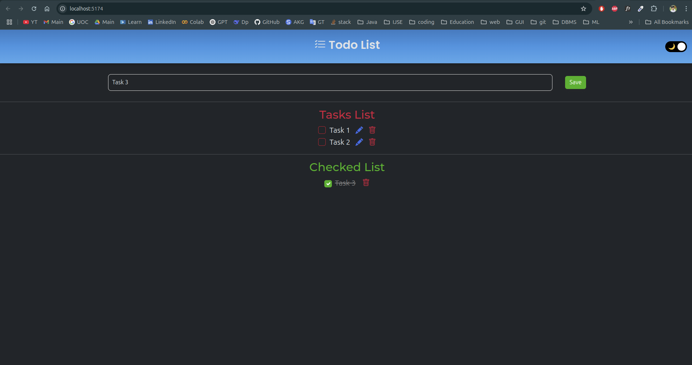

# Todo List App

## Version: `0.5.0`

## 📌 Overview
This is a simple **Todo List** application built using `HTML`, `CSS (Bootstrap)`, and `JavaScript`. It allows users to **add, edit, delete, and mark tasks as completed**.

The project is still in development, and future updates will include **Firebase integration** for real-time data storage and **Google authentication** for multi-user access.

---

## ✨ Features
- ✅ **Add tasks** to the list
- ✏️ **Edit** existing tasks
- 🗑️ **Delete** tasks from the list
- ✅ **Mark tasks as completed**
- 📂 **Separate section for completed tasks**
- 🌗 **Dark mode toggle**
- 📱 **Responsive UI** using Bootstrap

---

## 🛠️ Technologies Used
- **Frontend:** `HTML`, `CSS (Bootstrap)`, `JavaScript`
- **Icons:** [Bootstrap Icons](https://icons.getbootstrap.com/)
- **Theme Management:** `Bootstrap Theme Switch`
- **Build Tool:** `Vite`

---

## Screenshots 📷



---

## 🚀 Installation
1. **Clone the repository:**
   ```sh
   git clone https://github.com/vimukthijayasanka/tasky-todo-list?tab=readme-ov-file
   ```
2. **Navigate to the project directory:**
   ```sh
   cd todo-list-app
   ```
3. **Install dependencies:**  
   Since `node_modules` is not included in the repository, you must install dependencies:
   ```sh
   npm install
   ```
4. **Run the development server:**
   ```sh
   npm run dev
   ```

---

## 🔄 Running After Cloning
If you cloned this repository and want to run the app, follow these steps:
1. **Install dependencies:**
   ```sh
   npm install
   ```
2. **Start the Vite development server:**
   ```sh
   npm run dev
   ```

### 🔹 Automating the Start Process
To automatically start the development server after installing dependencies, add this script in `package.json`:
```json
"scripts": {
  "dev": "vite",
  "build": "vite build",
  "preview": "vite preview",
  "postinstall": "npm run dev"
}
```
This ensures that running `npm install` will also start the app.

---

## 🔮 Future Plans
### 🔥 **Firebase Integration**
- 📂 **Save tasks** to Firebase database
- 🔄 **Sync tasks** across multiple devices

### 👥 **Google Authentication**
- 🔑 Allow **multiple users** to log in and manage their tasks separately
- 🔒 Secure data storage **per user**

### 🎨 **UI Enhancements**
- 🏗 **Improve animations** and transitions
- 📱 **Better user experience** on mobile devices

---

## 🤝 Contributions
Contributions are **welcome**! Feel free to **fork** the project and submit pull requests.

---

## 📜 License
This project is licensed under the **[MIT License](license.txt)**.

---

Stay tuned for updates 🚀

